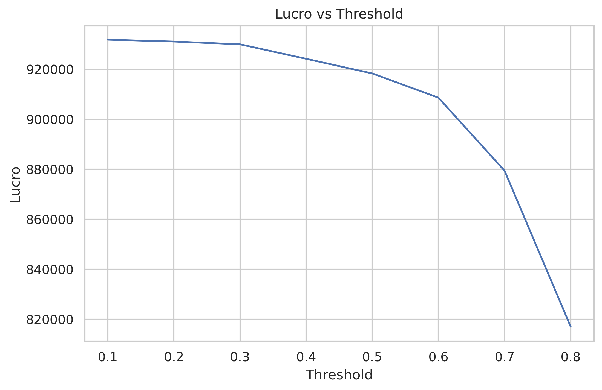

# 📊 Análise de Propensão a Empréstimos

## 🎯 Objetivo

Este projeto foi desenvolvido como parte do meu aprendizado em Data Science.

O objetivo é analisar dados de clientes bancários e entender quais fatores influenciam a aceitação de empréstimos pessoais.

---

## 🧠 Sobre o Projeto

Este é um projeto inicial, onde pratiquei conceitos importantes da área, como:

* Análise exploratória de dados (EDA)
* Visualização com gráficos (Matplotlib e Seaborn)
* Treinamento de um modelo simples de Machine Learning
* Interpretação básica dos resultados

Durante o desenvolvimento, utilizei **Inteligência Artificial (ChatGPT)** como apoio para:

* Entender melhor os conceitos
* Estruturar o código
* Corrigir erros e melhorar a análise

👉 Todo o projeto foi estudado e adaptado por mim com base no meu nível atual.

---

## 🧹 Etapas Realizadas

* Verificação de valores nulos e duplicados
* Análise estatística básica
* Visualização dos dados
* Análise de correlação entre variáveis
* Treinamento de um modelo simples (Random Forest)
* Simulação básica de impacto de negócio

---

## 📊 Visualização

### 📈 Exemplo de gráfico gerado no projeto

👉 O gráfico mostra uma simulação simples de como o lucro pode variar de acordo com o critério de decisão do modelo.

---

## 🔍 Principais Aprendizados

* Clientes com maior renda tendem a aceitar mais empréstimos
* Variáveis financeiras têm maior influência na decisão
* Modelos de Machine Learning podem ajudar na tomada de decisão

---

## 💡 Observação sobre a análise

Este projeto contém uma **simulação inicial de cenário de negócio**, apenas para fins de aprendizado.

Ainda estou evoluindo meu conhecimento em:

* métricas de avaliação
* otimização de modelos
* análise mais avançada

---

## 🚀 Próximos Passos

* Melhorar a análise exploratória
* Testar outros modelos
* Aprender mais sobre métricas como ROC-AUC e F1-score
* Evoluir na interpretação de resultados

---

## 📌 Observação Final

Este projeto faz parte do meu processo de aprendizado em Data Science.

Estou no início da jornada e utilizando IA como apoio para acelerar o entendimento e desenvolvimento das análises.

---
